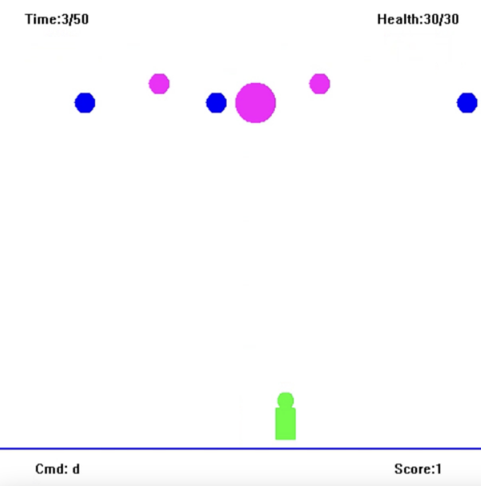
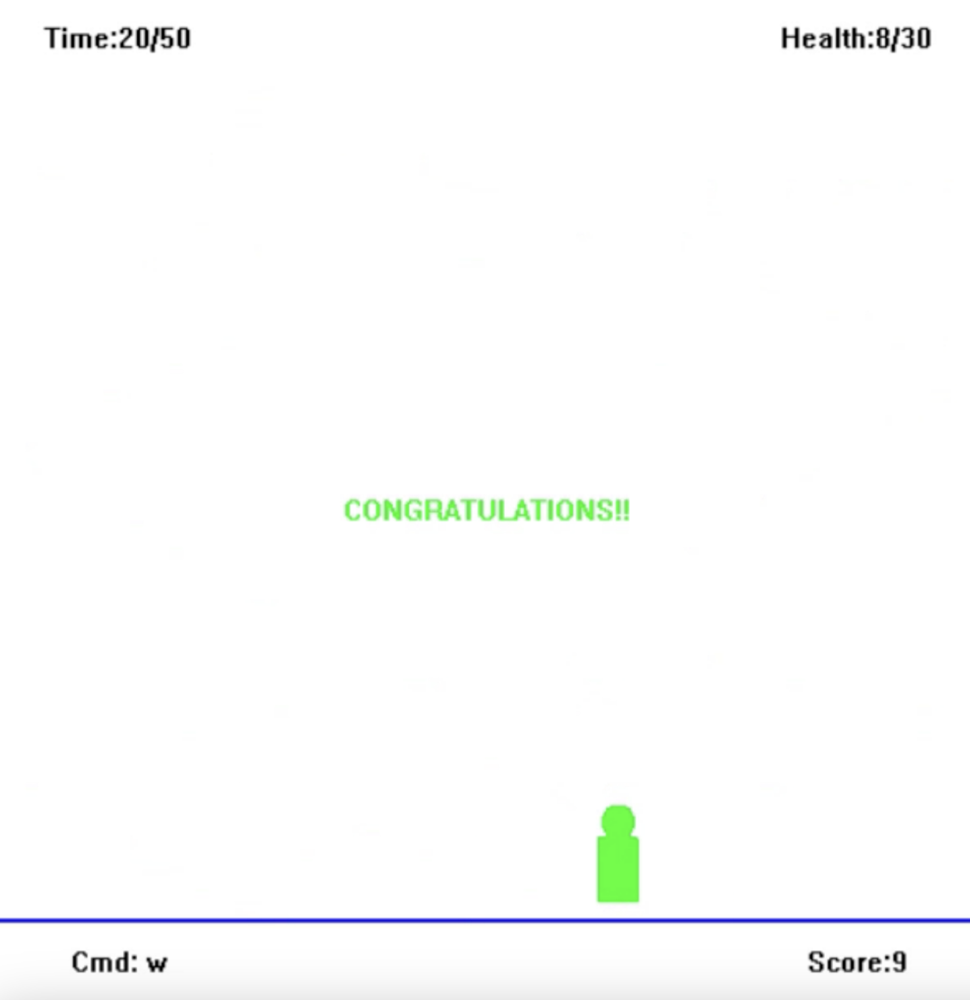
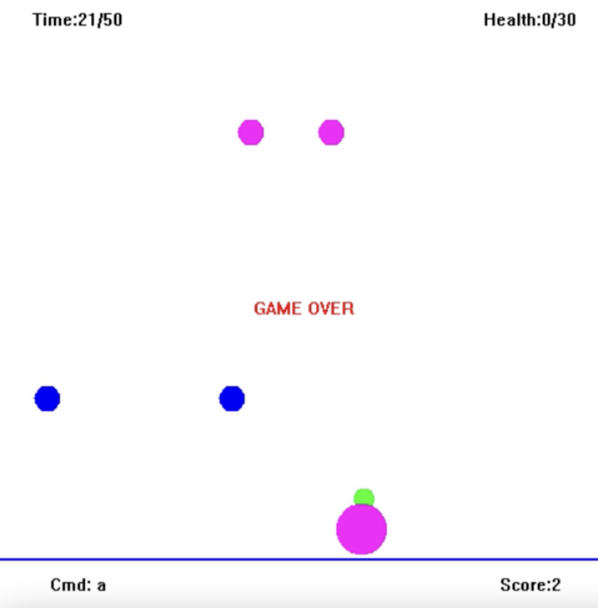

# Bubble Shooter Game
Bubble Trouble, an interactive bubble shooter game designed in C++ with optimizations for more frames and visually appealing look.
## Author - Omkar Nitsure
Email - omkarnitsure2003@gmail.com  
github profile - https://github.com/omkarnitsureiitb  

The video demonstrating the **features implemented in the game** can be found <a href = "IMPLEMENTED FEATURES.mp4">here</a>

I have implemented the following features in the game - 
1. I have created bubbles of **2 different sizes**(radius = 10 and 20) and **colours**(blue and pink)
  so that there are **3 small bubbles** and **2 bigger bubbles** at the beginning of the game.
2. I have added **acceleration in y direction** for both bubbles to produce parabolic trajectory.
3. I have added the feature that bubbles bounces off both the horizontal ground and top border.
4. I have introduced **collision between a bubble and a bullet** so that score increases by 1 when a bullet hits a bubble.
5. If bullet hits the bigger bubble then the bubble splits in 2 small bubbles and bullet is destroyed.
6. If bullet hits the smaller bubble then both the bubble and bullet disappear. 
7. I have introduced **collision between a bubble and the shooter**,
  and the **health** continues to decrease as long as the bubble is in contact with the shooter.
8. I have added **texts** which display **score ,health and time remaining in the game**.Initially score is 0.
  Player gets **30 units of health** and **50 units**(which is not 1 second) of time at the start of the game.
9. **Player wins if all bubbles are destroyed** and a "congratulations!!" message is displayed.
  Player loses and the game ends if either **health is used up** or **time is over** and a "Game over" message is displayed.
  
Following are the **snapshots** of how the game actually looks in action. They also demonstrate various features -  

  
